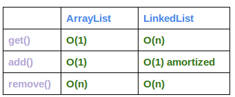

## ArrayList와 LinkedList의 차이가 무엇인가요?

1. 공간적 제약

- ArrayList : 배열이므로, 길이가 고정되어있다.
- LinkedList : 한 개의 Node는 다른 Node에 대한 참조만 가지고 있다. 따라서 공간적 제약을 상대적으로 덜 받는다

2. 새로운 요소 추가

- ArrayList : 새로운 요소를 추가할 때, 여유 공간이 이쓴 경우엔 O(1)이지만, 여유공간이 없는 경우에는 O(n)이므로, O(n)
- LinkedList : 한 개의 Node는 다른 Node에 대한 참조만 가지고 있다. 따라서 공간적 제약을 상대적으로 덜 받는다

