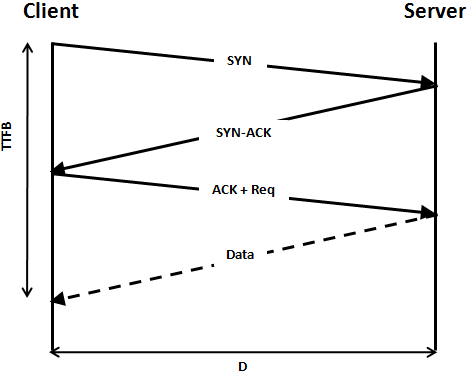

## TCP 3-Way HandShake


- TCP/IP 통신 기법 중 하나로, TCP/IP 프로토콜을 이용하여 통신하기 전에 정확한 전송을 보장하고자 연결이 잘 되어있는지 확인하는 것
- 보통 데이터 송수신 시작 전에 이뤄짐

```
1. 클라이언트는 서버에게 접속요청을 위한 SYN 패킷을 보냅니다. 클라이언트는 SYN을 보낸 후 SYN/ACK 응답을 기다리는 SYN-SENT 상태가 됩니다.

2. 서버가 Listen 상태일 경우에 SYN을 수신받습니다. 이후 요청수락인 ACK와 SYN flag 패킷을 보냅니다. 이 때, 서버는 SYN-RECEIVED 상태가 됩니다.

3. 클라이언트는 ACK를 서버에게 보내고 이 이후부터는 연결상태로 되어 데이터를 송수신합니다.
```




## TCP 4-Way HandShake

- TCP 3-Way HandShake 와는 반대로 데이터 송수신이 끝나고, 클라이언트와 서버 간 연결을 종료하기 위해 수행하는 것


```
1. 클라이언트가 서버에게 FIN Flag를 전송합니다. 클라이언트가 전송하고나서 FIN-WAIT 상태가 됩니다.

2. 서버가 FIN Flag를 받고, 클라이언트에게 ACK를 보냅니다. 이 때, 서버는 CLOSE_WAIT 상태가 됩니다.
- 그럼 클라이언트는 다음 FIN Flag를 받기 전까지 TIME-OUT 상태가 되고, 남은 데이터를 받으며 종료할 준비를 합니다.

3. 데이터를 모두 보낸 서버는 이제 연결종료의 의미인 FIN Flag를 클라이언트에게 전송합니다.

4. 클라이언트는 이를 받고 ACK 메세지를 서버에 전송합니다.
- 서버는 이러한 ACK 메세지를 받고 CLOSED 하는 것으로 클라이언트와 서버 간 통신은 마무리됩니다.
```


