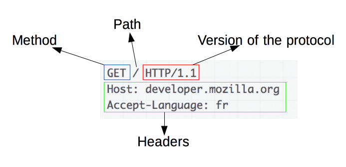

## HTTP(Hyper-Text Transfer Protocl)

```
- 하이퍼텍스트 문서를 교환하기 위한 응용 계층 프로토콜
- 웹 서버와 클라이언트 간에 데이터를 주고받기 위해 만들어놓은 통신 규약
```

- 클라이언트 - 서버 구조에 사용되는 프로토콜
  - 요청 - 응답 구조를 가지면서 인터넷에서 가장 많이 사용되는 프로토콜

- 클라이언트가 요청을 생성하기 위한 연결을 연 다음, 응답 받을때까지 대기하는 클라이언트 - 서버 모델을 따름
- 서버가 클라이언트의 요청에 응답한 후에는 클라이언트와 서버의 연결이 끊어지는 비연결성(Connectionless) 프로토콜이다.
- 서버가 두 요청 간에 어떠한 상태나 데이터를 유지하지 않는 무상태 프로토콜


#### HTTP 동작 방식


```
클라이언트가 브라우저를 통해서 어떠한 서비스를 URI로 서버에 요청하면 서버는 해당 요청에 대한 결과를 응답한다.
```

1. TCP Connection
  - TCP 연결은 요청을 보내거나 응답을 받는데 사용된다. 클라이언트는 새 연결을 열거나, 기존 연결을 재사용하거나, 서버에 대한 여러 TCP 연결을 열 수 있다
2. HTTP 메세지 전송
3. 서버에 의한 전송된 응답을 읽음
4. TCP 연결을 닫거나 다른 요청들을 위해 재사용




1. HTTP Method + Path + 프로토콜 종류
2. HTTP 요청 헤더, 리소스를 요청하는 경로


1. 프로토콜 종류 + HTTP 상태 코드 + HTTP 상태 메시지
2. HTTP 응답 헤더

- HTTP 상태 코드

  - 1xx(정보): 요청을 받았으며 프로세스를 계속 진행함.
  - 2xx(성공): 요청을 성공적으로 받았으며 인식했고 수용함.
  - 3xx(리다이렉션): 요청 완료를 위해 추가 작업 조치가 필요함.
  - 4xx(클라이언트 오류): 요청의 문법이 잘못되었거나 요청을 처리할 수 없음.
  - 5xx(서버 오류): 서버가 명백히 유효한 요청에 대한 충족을 실패.

## HTTPS(Hyper-Text Transfer Protocol Secure)

```
- HTTP에 데이터 암호화가 추가된 프로토콜.
- 인터넷 상에서 정보를 암호화하는 SSL(Secure Socket Layer) 프로토콜을 사용하여 클라이언트와 서버가 자원을 주고받을 때 사용하는 통신 규약
```

- HTTP 에 Secure Socket이 추가된 형태로, 존의 HTTP 통신에 SSL 혹은 TLS(Transport Layer Security) 프로토콜을 조합하여 세션 데이터를 암호화한다.
- 공개키 암호화 방식을 사용한다.
- HTTPS는 검색엔진에 최적화되어있다.

- HTTP에 TLS 계층을 더한 프로토콜
  - TLS(SSL의 개선된 버전)은 서버와 브라우저 사이에 안전하게 암호화된 데이터를 전송할 수 있게 해 줌
  - HTTP는 80포트를 사용하고 HTTPS는 443번 포트를 사용


#### HTTPS 동작 방식


1. 클라이언트는 서버에 접속하면, 서버인증서(CA)를 받는다.
2. 서버인증서 신뢰 여부 체크 후, 공개키를 추출한다.
3. 클라이언트는 서버와 통신하는 동안만 사용할 대칭키를 임의로 만들고, 해당 대칭키를 공개키로 암호화 후 전송한다.
4. 서버는 개인키로 클라이언트가 보낸 메시지를 복호화하여 대칭키를 추출하고, 해당 대칭키를 이용하여 클라이언트와 통신한다.
