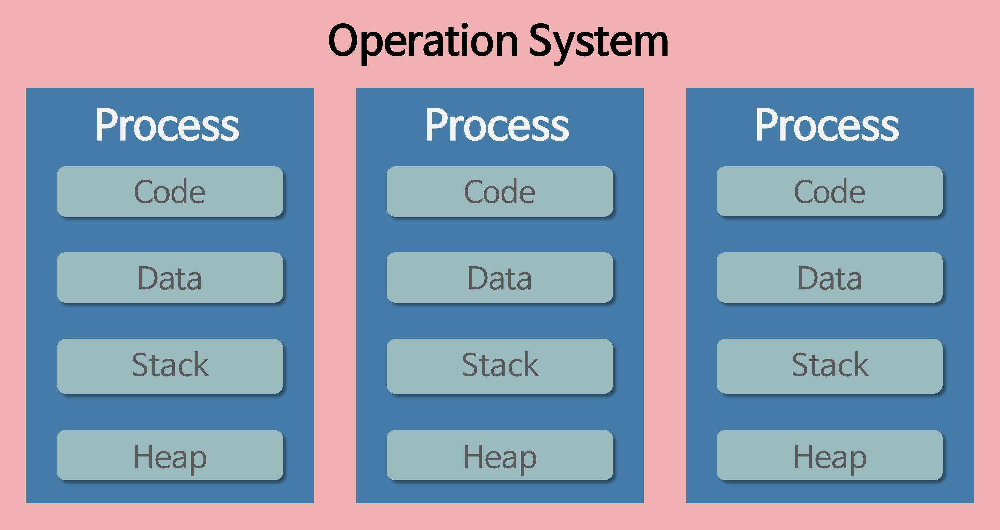

### 프로세스와 스레드의 차이

#### Program(프로그램)

- 사전적 의미 : 어떤 작업을 위해 실행할 수 있는 파일
- .exe 파일 같은 것들

#### Process(프로세스)

- 사전적 의미 : 컴퓨터에서 연속적으로 실행 되고 있는 컴퓨터 프로그램
- 메모리에 올라와 실행되고 있는 프로그램의 인스턴스 (독립적인 개체)

- 운영체제로부터 시스템 자원을 할당받는 작업의 단위이다.
- 프로세스는 각각 독립된 메모리 영역(Code, Data, Stack, Heap의 구조)을 할당받는다.

- 운영체제로부터 시스템 자원(CPU 시간, 메모리 등)을 할당받음.

- 프로세스 당 최소 1개의 스레드(메인 스레드)를 가지고 있다.

#### Thred(스레드)

- 사전적 의미 : 프로세스 내에서 실행되는 여러 흐름의 단위

- 스레드는 프로세스 내에서 각각 Stack만 따로 할당받고, Code,Data,Heap 영역은 공유한다.

- 같은 프로세스 안에 있는 여러 스레드들은 같은 힙 공간을 공유한다. 반면에 프로세스는 다른 프로세스의 메모리에 직접 접근할 수 없다.

---

- 프로세스 예시: Microsoft Word

- Microsoft Word 프로그램을 실행하면 하나의 프로세스가 생성되고 이 프로세스는 문서를 작성하고 편집하는 데 필요한 모든 코드와 데이터를 포함하고 있으며, 이 작업을 수행하기 위해 메모리에 로드된다.

- 독립적 메모리: Microsoft Word 프로세스는 다른 프로세스와 독립적인 메모리 공간을 가진다.
  예를 들어, 웹 브라우저 프로세스는 Word 프로세스의 메모리에 접근할 수 없다.

- 스레드 예시: Microsoft Word 내의 여러 작업

- Microsoft Word에서 문서 편집 중에 여러 작업을 동시에 처리할 수 있다. 예를 들어, 문서를 저장하는 작업과 실시간 철자 검사 작업이 동시에 이루어질 수 있다.

- 메모리 공유: 문서를 저장하는 스레드와 철자 검사를 수행하는 스레드는 같은 Word 프로세스의 메모리를 공유한다. 따라서 두 스레드 모두 동일한 문서 데이터를 읽고 쓸 수 있다.

- 독립적 스택: 각 스레드는 독립적인 스택을 가지므로, 한 스레드의 작업이 다른 스레드의 작업에 직접적인 영향을 미치지 않는다.
